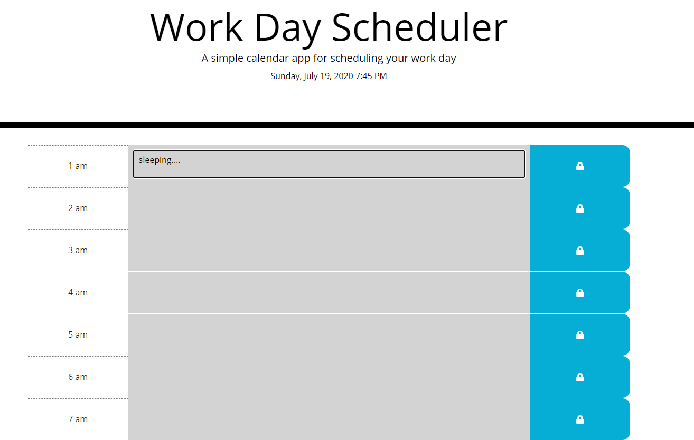

# DayPlanner
Week 5 Homework - Day Planner

Create a simple calendar application that allows the user to save events for each hour of the day. This app will run in the browser and feature dynamically updated HTML and CSS powered by jQuery.

- User can access the planner to create a schedule. 
- Updated calendar to reflect a 24-hour period instead of typical work day (9-5pm) and being a person who has an atypical schedule, I appreciate having calendars that reflect all hours instead.
- Current day and time is reflected at the top of the planner
- When scrolling, time blocks are presented and color indicated to represent past, present and future hours
- When user clicks into time block, they can enter an event and click save icon
- The event is saved to local storage and when user refreshes the page, the event remains on display.

Resources: Moment.js for time format: <https://momentjs.com>;

=======
Screenshot of Project: 

